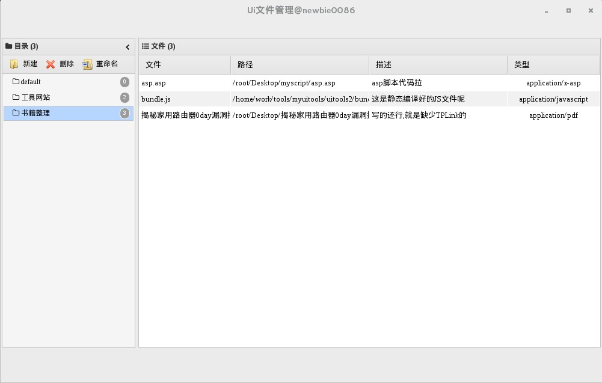
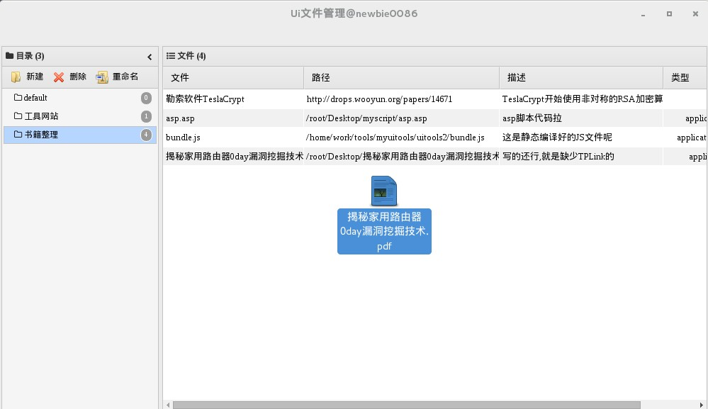
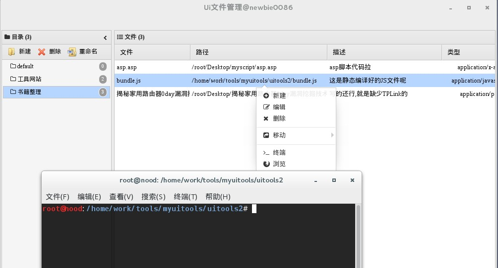

# uiTools - 有爱文件管理工具
> 妈妈再不用担心我locate,grep半天找不到想要的工具了

**一个轻量级的文件管理工具,可以像Windows下的音速启动器一样,只需要把文件或者文件夹拖拽到界面上,就能开始管理了,支持shell命令下打开文件所在路径,或者直接打开网址**    
**这个工具来源于乌云社区给我的灵感,感谢乌云**

[](https://nodejs.org/en/download/)

## 设计思想
> 基本按照中国蚁剑采用了的架构,[Electron](http://electron.atom.io/)作为外壳，`ES6`作为前端代码编写语言，搭配`Babel`&&`Webpack`进行组件化构建编译，`nedb`数据存储模块,

## 程序下载
如果你不需要关心代码如何编写以及没有改动等需求，那可以进入[下载页面](https://github.com/newbiethetest/uitools/releases)页面，选择你的系统版本进行下载对应压缩包，解压使用即可！运行./uitools即可

> **注意**: OSX 暂时不提供编辑版本,因为我不熟悉,压根没用过,有些命令需要自己修改,所以下载源码自行编译

### 下载源码
``` sh
$ git clone https://github.com/antoor/antSword.git
$ cd uitools
```

### 安装模块
``` sh
$ npm install
```
> 安装`electron-prebuilt`模块过程中会自动下载`electron`程序
> 想要快速下载,最好使用China牌cnpm来安装预编译环境
```sh
$ npm install -g cnpm
$ cnpm install electron-prebuilt@0.36.11
$ npm install 
```

### 编译源码
``` sh
$ npm run build
```


### 启动应用
``` sh
$ npm start
```
 
### 程序打包,如64位
``` sh
$ electron-packager  ./  --platform=linux --arch=x64 --ignore='^/node_modules/(?!(nedb|log4js))'
```
### 应用截图
> 瞧瞧这款工具都能干些什么

#### 主界面

#### 文件拖拽

#### 终端打开

#### 浏览器打开

#### 文件移动


**注意事项**
1,数据库保留在用户目录下.uitools/uitools.db
2,打开浏览器调用的是iceweasel 命令,你可以搜索这个关键字进行修改
3,shell打开调用的是x-terminal-emulator 
如果这两个功能打不开,自行编译你喜欢的浏览器打开或者联系我